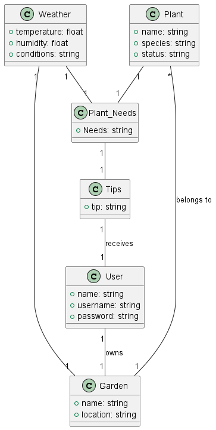
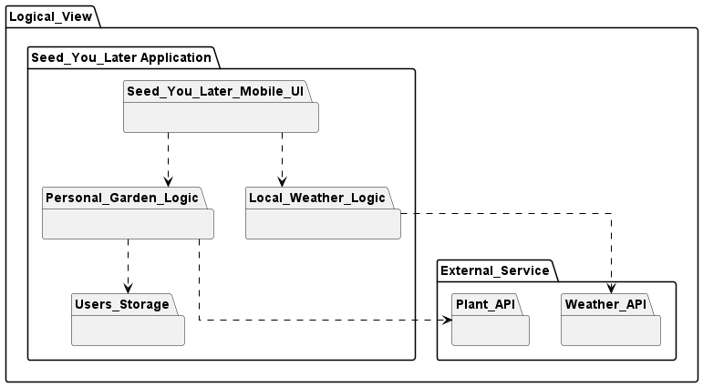
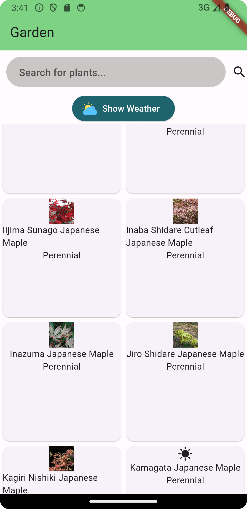
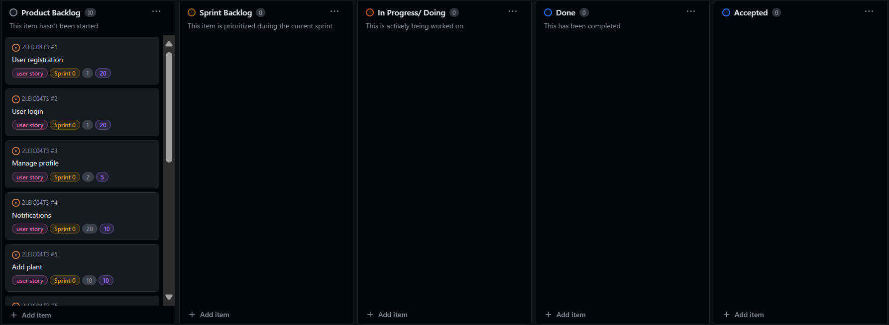
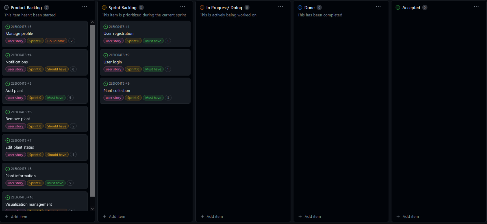
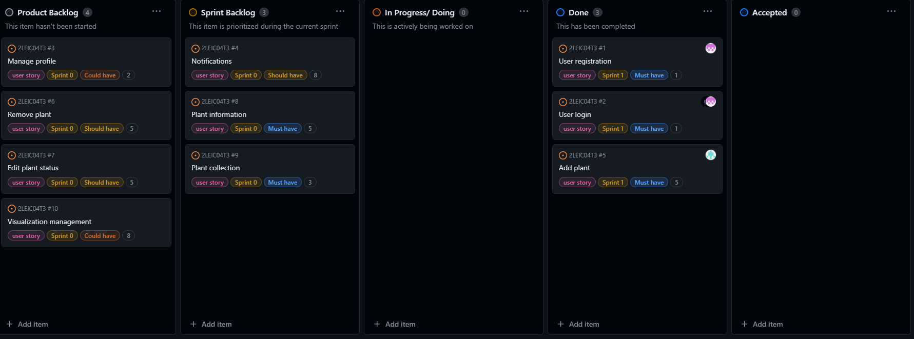
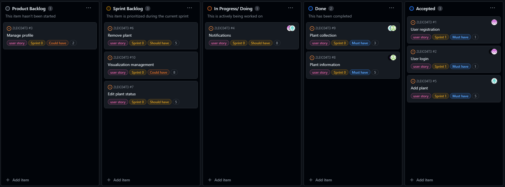

# Seed You Later Development Report

## Members

- Beatriz Alexandra de Almeida Bernardo - 202206097
- Diana Magalhães Moreira Nunes - 202208247
- Miguel de Sousa Neri - 202006475
- Sofia Afonso Gonçalves - 202205020
- Teresa Raquel de Azevedo Maia e Gonzaga de Mascarenhas - 202206828

---

Welcome to the documentation pages of the Seed You Later!

You can find here details about the Seed You Later, from a high-level vision to low-level implementation decisions, a kind of Software Development Report, organized by type of activities: 

* [Business modeling](#Business-Modelling) 
  * [Product Vision](#Product-Vision)
  * [Features and Assumptions](#Features-and-Assumptions)
  * [Dependencies](#Dependencies)
  * [Elevator Pitch](#Elevator-Pitch)
* [Requirements](#Requirements)
  * [User stories](#User-stories)
  * [Domain model](#Domain-model)
* [Architecture and Design](#Architecture-And-Design)
  * [Logical architecture](#Logical-Architecture)
  * [Physical architecture](#Physical-Architecture)
  * [Vertical prototype](#Vertical-Prototype)
* [Project management](#Project-Management)
* [Credentials](#Credentials)
* [Links](#Links)
* [Pitch Day](#Pitch-Day)

## Business Modelling

### Product Vision

"Seed You Later" aims to revolutionize gardening by providing a comprehensive platform that organizes plant collections and offers personalized care reminders, therefore fostering a deeper connection with nature. Our app will ensure, through notifications and essential data, that your plants have everything they need to thrive!

### Features and Assumptions

- **Create Accounts:** This feature allows users to register their new account by providing information such as email, username, and password.
- **Login:** Registered users can log in to their accounts using their credentials.
- **Manage Profile:** Users have the ability to manage their profiles by updating information such as their name, email, password and profile picture.
- **Notifications:** Send relevant and personalized notifications to the users about their plant, such as their watering needs.
- **Add plant:** Allow users to add new plants to their collection.
- **Remove plant:** Allow users to remove existing plants from their collection.
- **Edit plant status:** Enable users to update the status or condition of their plants.
- **Plant informations:** Provides information about a specific plant. It might include details such as its name, scientific name, species, description, ideal growing conditions, care instructions and watering information.
- **Plant collection:** Allows users to store the plants they want to take care of.
- **Visualization Management:** Allow users to manage how their plant data is displayed, such as organizing plants by category or sorting them by name.

### Dependencies

- API about the plants needs - Perenual
- API about the weather condition - WeatherApi

### Elevator Pitch

Introducing "Seed You Later" - your ultimate companion for cultivating a thriving garden and nurturing your connection with nature! Seamlessly organize your plant collection and receive timely reminders tailored to each plant's specific care requirements. From watering schedules to sunlight preferences, "Seed You Later" ensures your greenery thrives with ease. Embrace the joy of gardening and let "Seed You Later" be your guide towards a greener, more vibrant life.
         
### Domain model

  

 A user should own a garden,this garden should have is location specefied,and on this garden the user should have at least 1 type of plant, based on the garden location the app should know the current weather , and based on that weather and the types of plants that are in the garden, the app should develop the plant needs and based on those send tips to the user on how to have de best plant care possible.

## Architecture and Design

### Logical architecture

  

The main application is divided into:
- **Seed_You_Later_Mobile_UI:** Contains the user interface components for the mobile application.
- **Personal_Garden_Logic:** Handles the logic related to managing a user's personal garden within the application.
- **Local_Weather_Logic:** Deals with logic related to fetching and processing local weather information.
- **Users_Storage:** This package has storage mechanisms for user-related data.

There are also external services such as:
- **Plant_API:** An external API, used for retrieving information about plants.
- **Weather_API:** Another external API,used for obtaining weather data.

The relations bettween the components represented above are:
- The mobile UI interacts with both Personal_Garden_Logic and Local_Weather_Logic displaying information related to the user's garden and local weather.
- Personal_Garden_Logic interacts with Users_Storage for storing and retrieving user-related data, and with Plant_API for plant-related information.
- Local_Weather_Logic interacts with Weather_API to fetch weather data.

### Physical architecture

  

User_Smartphone Node:

- This node represents the user's smartphone environment.
- Within it, there's the "Seed_You_Later_App", developed using Flutter framework, indicating that the application is built for mobile platforms.
- Inside the application, there are two main components: "Personal_Garden" and "Local_Weather." These represent different features of the application.
- Both "Personal_Garden" and "Local_Weather" components interact with their respective logic components, "Personal_Garden_Logic" and "Local_Weather_Logic."
- User data is stored in a database, represented by "Users_Storage",  holding information related to user profiles, garden data, etc.

Plant_Server Node:

- This node hosts the "Plant_API," which presumably serves plant-related data to the application.

Weather_Storage Node:

- This node hosts the "Weather_API," responsible for storing and providing weather-related information to the application.

Relations:

- The "Personal_Garden" and "Local_Weather" components interact with their respective logic components,with these being integral to the functionality of their corresponding features.
- Both "Personal_Garden_Logic" and "Local_Weather_Logic" interact with external services: "Plant_Server" for plant-related data and "Weather_Storage" for weather-related data. 

### Vertical prototype

  

We begin by designing the garden layout where the user will store their plants. The plants selected on the screen are fetched from the Perenual API, where we also retrieve information about their specific care needs. Additionally, our application utilizes a weather API to fetch the meteorological conditions of a city of our choice.

## Project management

Presented here are details and sources concerning project management within our group:

* Backlog management: Product backlog and Iteration backlog in a [Github Projects board](https://github.com/orgs/FEUP-LEIC-ES-2023-24/projects/65);

* Sprint review: [Retrospectives](https://github.com/FEUP-LEIC-ES-2023-24/2LEIC04T3/blob/main/docs/retrospective.md)

* Sprints:

> ## Sprint 0
> 

>  
> 

> 
> [Release1](https://github.com/FEUP-LEIC-ES-2023-24/2LEIC04T3/releases/tag/v1.0.0)

> ## Sprint 1
> 

>  
> 

> 
> [Release2](https://github.com/FEUP-LEIC-ES-2023-24/2LEIC04T3/releases/tag/v2.0.0)

> ## Sprint 2
> 

>  
> 

>
> [Release3](https://github.com/FEUP-LEIC-ES-2023-24/2LEIC04T3/releases/tag/v3.1.0)

> ## Sprint 3
> 

>  
> 

>
> [Release4](https://github.com/FEUP-LEIC-ES-2023-24/2LEIC04T3/releases/tag/v3.3.0)

### Credentials
It's possible to register on our app, but if it is more convinient:
- **Login**- ola@email.com  
- **Password**- alooooo

### Links

- [ChangeLog](https://github.com/FEUP-LEIC-ES-2023-24/2LEIC04T3/blob/main/docs/sprints/CHANGELOG.md)
- [Retrospective](https://github.com/FEUP-LEIC-ES-2023-24/2LEIC04T3/blob/main/docs/retrospective.md)

### Pitch Day

Quem aqui já quis ter um jardim? E quem aqui já abandonou essa ideia porque teve medo de não ter o conhecimento necessário ou de deixar as plantas morrerem?
Eu também!!!

E por isso trago-vos a SeedYouLater.

A SeedYouLater é uma app dedicada a todos os iniciantes na criação e manutenção de jardins, garantindo que tudo vai correr bem.

Para isso, tem uma enorme base de dados com informações sobre diferentes plantas e, juntamente com o seu sistema de meteorologia em tempo real, formula a melhor maneira de as regar.

E então, como funciona?

Bom, começam por fazer o registo para terem acesso ao vosso jardim virtual, definem a sua localização, adicionam-lhe as plantas pretendidas e, VOILÁ! A partir de agora, a app faz tudo. 
Com base nas informações fornecidas e na meteorologia, são enviadas notificações para que nunca se esqueçam de quando cada planta deve ser regada.

Posto isto, quem está pronto para começar a plantar?!

Obrigado pela vossa atenção. SeedYouLater.
