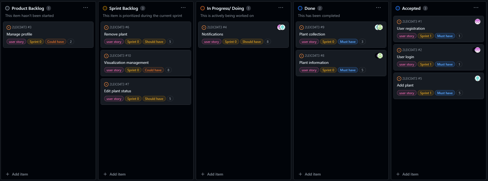

## Retrospective 

* [Sprint 1](#Sprint-1)
* [Sprint 2](#Sprint-2)
* [Sprint 3](#Sprint-3)
* [Review](#Review)

## Sprint 1

### What went well?

    We accomplished our goals and maintained a steady work pace.
    

### What should we do differently?

    We could have done more pair-programming. Closer collaboration would be beneficial to ensure all team 
    members have a better understanding of our application's progress.

### What still puzzles me?
    
    Learning how the firebase works and how to program in dart.

### How we are going to improve?

    We'll take time for team members to deepen their understanding of Firebase and Dart programming through 
    asking more questions to the monitors. Additionally, we will try to improve more frequent collaboration and
    knowledge sharing between team members by reuniting at least two times a week in person to check how the work is 
    doing and to ask each other doubts.

## Review Feedback

    - Change account and settings icons
    - Add a hide/show password feature to login and registration interfaces
    - Weather API is not working
    - We need to improve on plant information
    - Lack of explanation as to why the password is not accepted

### Project board

    

  

## Sprint 2

### What went well?

    We achieved our goal of gaining a deeper understanding of how to manage firebase, and we are now able to program better in Dart.
    

### What should we do differently?

    We still needed closer collaboration to ensure all team members
    had a better understanding of the progress of our application.

### What still puzzles me?
    
    How to make less api calls, and avoid expiring the daily call limit, and how ysers can receive notifications at the 
    scheduled time through different means.

### How we are going to improve?

    We need to learn other possible ways to get data from the api, without having to make too many calls.
    We still need to find a way for the user to be notified.

## Review Feedback

    - User can't receive notifications from the application
    - Improvements in Readme.md
    - Specification of bugs/ fixes on board

### Project board

    

  

## Sprint 3

### What went well?

    We achieved our goal of implementing the features we set out to do.

### What should we do differently?

    If we had more time, we could have made it so users can share their gardens with each other.

### What still puzzles me?
    
    How to make the notifications work outside the app.

### How we are going to improve?

    We still need to learn other possible ways to get data from the api, without having to make too many calls.

### Project board

    

 

## Review

Taking into account all our work throughout this project, we reached the following conclusions:

- The most limiting factor was the fact that the plant API has a limited number of calls (100 calls per day), which made it 
  impossible for us to fill in the different plant cards we had with all the information we added and wanted about each plant 
  (the search for this information would cause the daily API call limit to expire very quickly)

- With this project, we learned essential tools for future projects and work, as we were taught organization and time management 
  methods -- through user stories and sprint planning on the Scrum Board.

- Furthermore, this project made us all more proficient in relating various tools in order to make a more solid application, 
  useful and intuitive for the general public to use.

